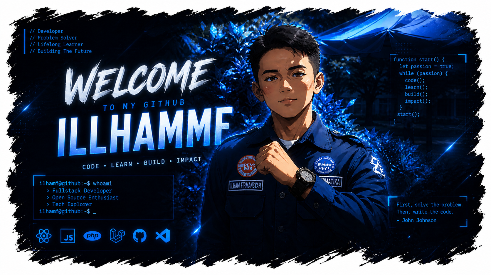

  

<!-- BANNER -->

  

  
  
  

    

---

## About Me

- 🎓 Student at **Universitas Esa Unggul**
- 💻 Passionate about **Programming & Technology**
- 🔥 Currently building projects and improving skills
- 🚀 Love exploring new tech and challenges

---

## Tech Arsenal

### 🌐 Web Development

### 🗄️ Database

### 🤖 Data & Programming

### 🐳 DevOps & Infrastructure

### 🛠️ Development Tools

---

## Most Used Languages

  

  
  

---

## Detailed Statistics

  
  

  

 
  

  

  

---

## Contribution Calendar

  

---

## Contribution Snake

  <picture>
    <source media="(prefers-color-scheme: dark)" srcset="https://raw.githubusercontent.com/illhammf/illhammf/output/github-contribution-grid-snake-dark.svg">
    <source media="(prefers-color-scheme: light)" srcset="https://raw.githubusercontent.com/illhammf/illhammf/output/github-contribution-grid-snake.svg">
    
  </picture>

---
