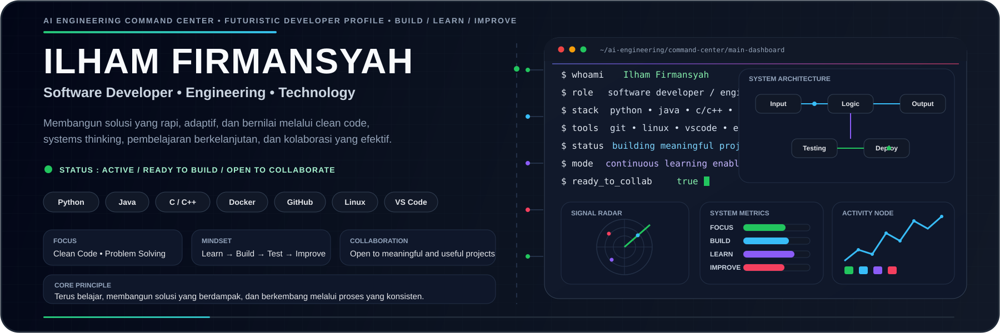
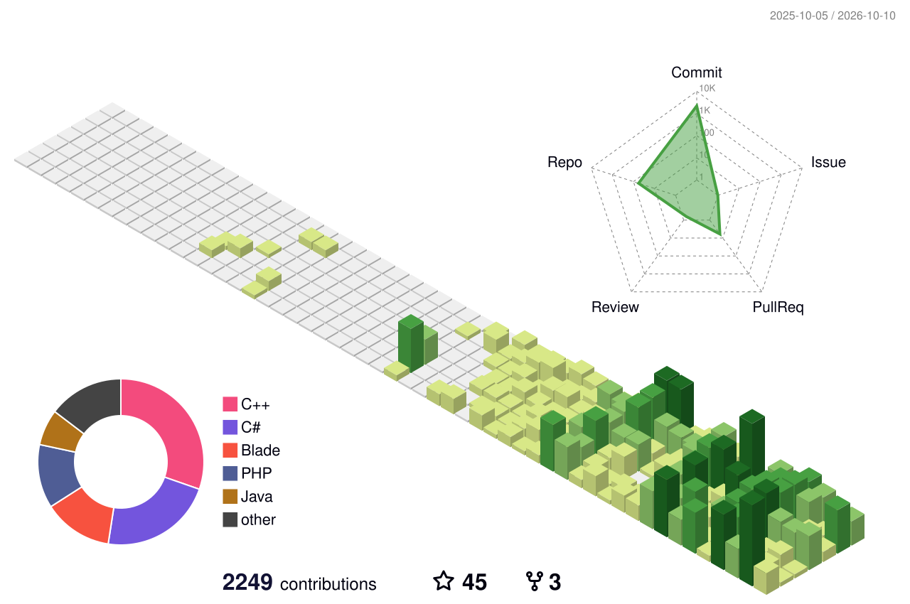

<!-- BANNER -->

  

---

## About Me

- Student at **Universitas Esa Unggul**
- Passionate about **Programming & Technology**
- Currently building projects and improving skills
- Love exploring new tech and challenges
- **Always learn** from mistakes
- The most meaningful life is one that brings benefit to others

---

## Tech Arsenal

<h3 align="center">Programming Languages</h3>

<h3 align="center">Web Development</h3>

<h3 align="center">Mobile Development</h3>

<h3 align="center">IoT & Embedded System</h3>

<h3 align="center">Database & Backend</h3>

<h3 align="center">DevOps & Infrastructure</h3>

<h3 align="center">Development Tools</h3>

---

## Contribution Snake

  <picture>
    <source media="(prefers-color-scheme: dark)" srcset="https://raw.githubusercontent.com/illhammf/illhammf/output/github-contribution-grid-snake-dark.svg">
    <source media="(prefers-color-scheme: light)" srcset="https://raw.githubusercontent.com/illhammf/illhammf/output/github-contribution-grid-snake.svg">
    
  </picture>

 

## Contribution Pacman (still unstable)

  <picture>
    <source
      media="(prefers-color-scheme: dark)"
      srcset="https://raw.githubusercontent.com/illhammf/illhammf/output/pacman-contribution-graph-dark.svg"
    />
    <source
      media="(prefers-color-scheme: light)"
      srcset="https://raw.githubusercontent.com/illhammf/illhammf/output/pacman-contribution-graph.svg"
    />
    
  </picture>

 

## 3D Contribution Graph

  <picture>
    <source
      media="(prefers-color-scheme: dark)"
      srcset="./profile-3d-contrib/profile-night-green.svg"
    />
    <source
      media="(prefers-color-scheme: light)"
      srcset="./profile-3d-contrib/profile-green-animate.svg"
    />
    
  </picture>

 
---
