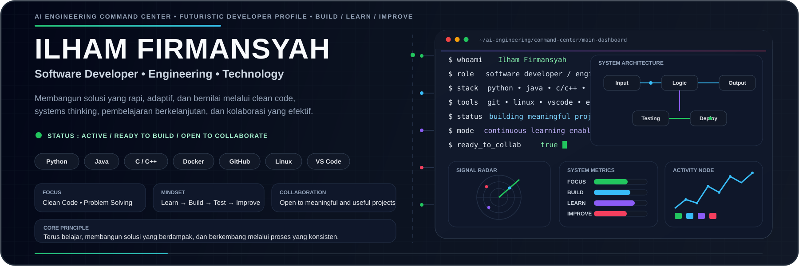
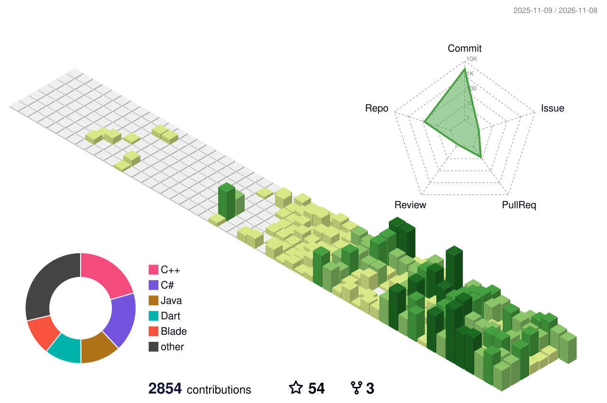

<!-- BANNER -->

  

---

## Contribution Snake

  <picture>
    <source media="(prefers-color-scheme: dark)" srcset="https://raw.githubusercontent.com/illhammf/illhammf/output/github-contribution-grid-snake-dark.svg">
    <source media="(prefers-color-scheme: light)" srcset="https://raw.githubusercontent.com/illhammf/illhammf/output/github-contribution-grid-snake.svg">
    
  </picture>

## Contribution Pacman

  <picture>
    <source
      media="(prefers-color-scheme: dark)"
      srcset="https://raw.githubusercontent.com/illhammf/illhammf/output/pacman-contribution-graph-dark.svg"
    />
    <source
      media="(prefers-color-scheme: light)"
      srcset="https://raw.githubusercontent.com/illhammf/illhammf/output/pacman-contribution-graph.svg"
    />
    
  </picture>

## Contribution Graph

  <picture>
    <source
      media="(prefers-color-scheme: dark)"
      srcset="./profile-3d-contrib/profile-night-green.svg"
    />
    <source
      media="(prefers-color-scheme: light)"
      srcset="./profile-3d-contrib/profile-green-animate.svg"
    />
    
  </picture>

---
